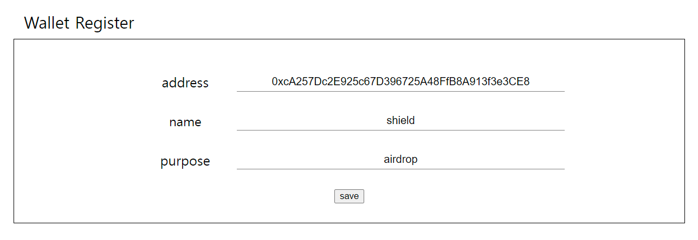
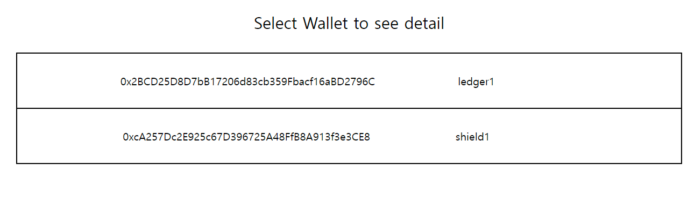
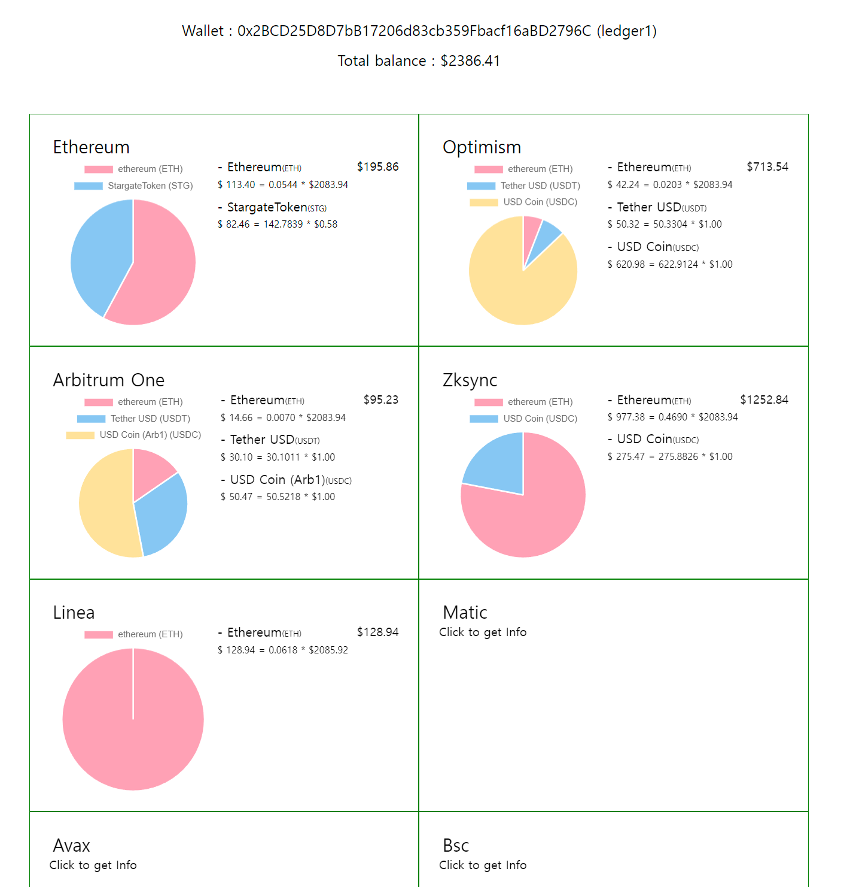
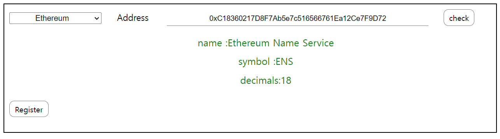

# calculator

여러 지갑, 체인에 걸쳐 흩어져 있는 디지털 자산들을 한눈에 볼 수 있게 하기 위해

만들어 본 어플리케이션 입니다.

프론트 앤드는 리액트를, 백엔드는 nestjs를 사용했고,

블록체인과의 통신을 위해서는 인프라, 알케미 등의 퍼블릭 노드,

실시간 토큰 관련 정보를 확인하기 위해 코인겟코의 api를 사용했습니다.

백엔드 서버와 블록체인과 상호작용을 위해 etherjs 라이브러리를 사용했으며,

연속적인 요청을 여러 번 보내는 경우 발생하는 429 error를 줄이기 위해

백엔드 서버와 블록체인 인프라 사이에 redis를 두어 최근 요청한 데이터를 캐시하도록 했습니다.

## 1. 지갑 등록

main 탭에서 자산의 관리를 원하는 이더리움 계열 체인의 지갑을 등록할 수 있습니다.

## 2. 자산 확인

Wallet 탭에서 원하는 지갑을 선택하면 자산 화면으로 이동합니다.

원하는 네트워크의 자산을 불러올 수 있습니다.

(짧은 간격으로 너무 많은 요청을 보낼 수는 없습니다.)

## 3. 관심 코인 추가

이더스캔 등의 스캐너 사이트에서는 스캠을 위한 코인이나 당장은 필요없는

nft등이 코인리스트에 보여져 거슬릴 때가 있습니다.

이 어플리케이션에서는 관심이 있는 코인만을 등록해서 볼 수 있습니다.

