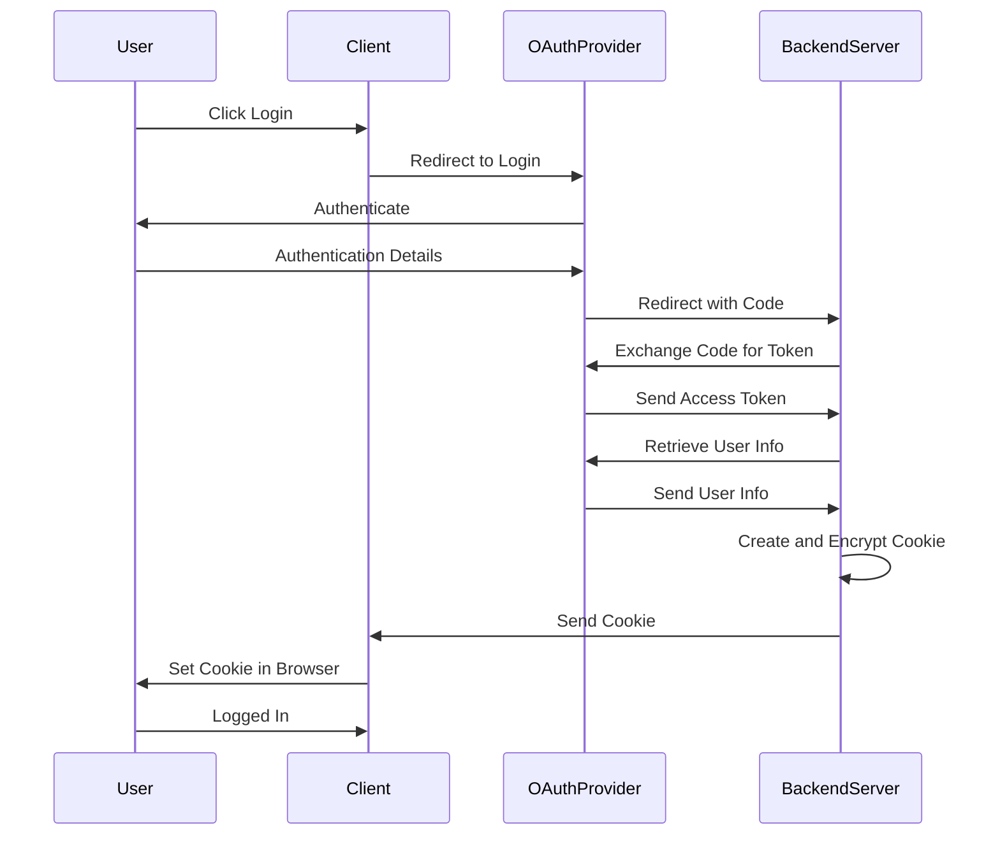

백엔드 서버가 프론트엔드 서버에 응답으로서 쿠키를 줬고,

프론트엔드 서버는 브라우저에 쿠키를 저장했다.

이 과정에 대한 더 깊은 이해를 위해 정리해봄..

0. authorization(인가), authentication (인증)

둘의 차이를 알고 넘어가자.

인증은 사용자의 신원을 증명하는 것.

인가는 특정 리소스에 접근할 수 있는 권한을 부여하는 것이다.

1. 제3자 앱을 통한 user 인증

`인증`, `Authentication`는 사용자의 신원을 증명하는 것이다.

사용자를 제3자 앱으로 리다이렉트 시킨다.

사용자는 제3자 app에 로그인하고, 필수적인 권한을 부여한다.

제3자 app은 사용자를 다시 callback url로 `authorization code`, `인가 코드`와 함께 리다이렉트 시킨다.

(일반적으로 callback url은 백엔드 서버가 됨)

2. backend가 code를 token과 교환한다.

백엔드가 `인가 코드`를 받아 제3자 app에 전송하고, 이를 access token과 교환한다.

다시 access_token을 사용자 정보와 교환한다.

받은 사용자 정보를 암호화, 인코딩해서 쿠키로서 프론트엔드에 전달할 준비를 한다.

3. 백엔드가 쿠키를 셋

백엔드가 프론트엔드에 `Set-Cookie` header와 함께 응답한다. 여기에 암호화된 유저 정보도 포함되어 있음.

이는 사용자의 브라우저에게 쿠키를 저장하라는 지시이다.

4. 브라우저가 쿠키를 저장한다.

사용자의 브라우저가 `Set-Cookie` header를 백엔드에서 받았다면

지시대로 쿠키를 저장한다.

브라우저는 백엔드 서버(or 쿠키의 범위에 속하는 다른 서버)에 대한 후속 요청에 이 쿠키를 포함한다.

5. 프론트엔드가 응답을 받는다.

쿠키를 세팅하는 것 이외에도 백엔드는 프론트엔드가 사용할 수 있는 response body에 추가적인 정보를 보내기도 한다.
(e.g. profile data, success msg, ...)

프론트엔ㄷ는 해당 정보를 이용해 ui를 업데이트할 수 있다.

6. 쿠키를 포함한 이후 요청
   이 후 브라우저가 백엔드에 요청을 보낼 때 자동적으로 쿠키를 req header에 포함해 보낸다.

백엔드는 사용자 정보를 탐색하기 위해 쿠키를 해독해 사용자를 식별, 검증한다.



7. cookie parsing을 위한 셋업

프론트에서 백엔드에 요청을 보낼때 항상 쿠키를 헤더에 담아 보내겠지만,

이를 백엔드에서 읽으려면 관련된 셋업과 lib가 필요하다.

```bash
        npm i cookie-parser
        npm i --save-dev @types/cookie-parser
```

이를 import 해주고 사용한다.

```ts
import cookieParser from "cookie-parser";

// ...

app.use(cookieParser());
```

안되네.. 왜 안되지..

오늘은 여기까지 하자..
